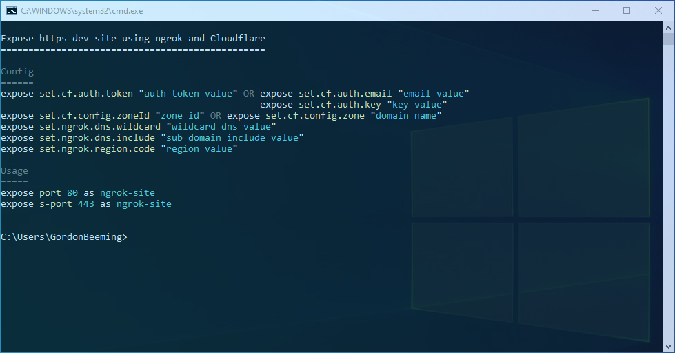

# Expose https dev site using ngrok and Cloudflare

More/Some docs will come still

## Build Status

## Basic overview

I use [ngrok](https://ngrok.com/) and [cloudflare](https://cloudflare.com/) a lot for personal projects and demos. I've like the idea of using the whitelabeling part of ngrok for a long time because it's different (for no other reason 😅). Since starting to use my [beeming.net](beeming.net) and now my [beeming.dev](beeming.dev) domains for ngrok I've run into a little problem because I both those domains are in the HSTS preload list built into browsers. 

This is a great problem to have but still a problem that I needed to overcome. The main problem here is that although ngrok with my 'Friends of ngrok' license support wildcard whitelabeling, cloudflare doesn't on the free tier and I didn't want to go and upgrade to Enterprise just for wildcard proxying of requests.

My first idea was to get this all working using certs that I'm able to get through [digicert](https://www.digicert.com/) using the [NFR certs](https://www.digicert.com/friends/msmvp/) that they give to MVPs for testing purposes but then after some trying and getting tls connections to work but not the whole experience properly I decided to try some things out with cloudflare and when that worked created this little app.

## Usage

If you just run the app it will present you with the basic config that you need to add in, but in short you need to supply api keys for cloudflare and the config of what domain you are going to use and then you are ready to go.

